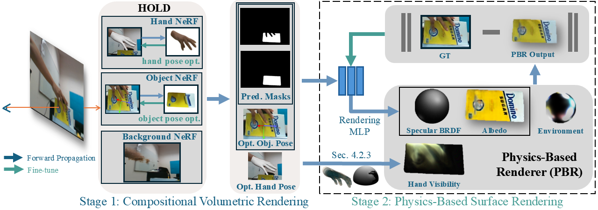

# TexHOI: Reconstructing Textures of 3D Unknown Objects in Monocular Hand-Object Interaction Scenes
<div style="text-align:center"></div>

## Quick Run
```
cd TexHOI-stage2
conda env create -f environment2.yml
conda activate texhoi_stage2
cd code
python training/exp_render.py --conf confs_sg/default.conf \
                              --data_split_dir ../../example_data/shsu10 \
                              --expname ShSu10 \
                              --gamma 1.0 \
                              --is_continue \
                              --timestamp example
```

See the output in ```TexHOI-stage2/exps/default-ShSu10/{current_timestamp}/plots```

## Data Setup
Download HO3D version 3 data from [here](https://github.com/shreyashampali/ho3d) and store as follows:

```
ho3d
{root}/ho3d/{seq_name}
{root}/ho3d/{seq_name}/rgb
{root}/ho3d/{seq_name}/meta
{root}/ho3d/{seq_name}/seg
```

You get 

`rgb` from `rgb` folder

`meta` from `meta` folder

and `seg` from meta pickle files.

## Environment Setup
```
cd TexHOI-stage1
conda env create -f environment1.yml
cd ..
```

```
cd TexHOI-stage2
conda env create -f environment2.yml
cd ..
```

## Run
```
seq_name=ShSu10             # Sequence folder name from HO3D training data
```

```
conda activate texhoi_stage1
python process_ho3d_stage1.py {seq_name}
```
```
cd TexHOI_stage-1/code
python train.py --case hold_{seq_name}_ho3d --num_epoch 200 --shape_init 5c09be8ac --eval_every_epoch 1 --num_sample 64
RENAME recent log folder as {seq_name}
python render.py --case hold_{seq_name}_ho3d --num_epoch 200 --shape_init 5c09be8ac --eval_every_epoch 1 --num_sample 64 --render_downsample 1 --agent_id -1 --load_ckpt logs/{seq_name}/checkpoints/last.ckpt
```

```
python implicit_seperate.py {seq_name}
python process_ho3d_stage2.py {seq_name}
cd TexHOI_stage-2/code
conda deactivate
conda activate texhoi_stage1
python training/exp_runner.py --conf confs_sg/default.conf --data ../../example_data/{seq_name} --expname {seq_name} --nepoch 2000 --max_niter 2000001 --gamma 1.0
```